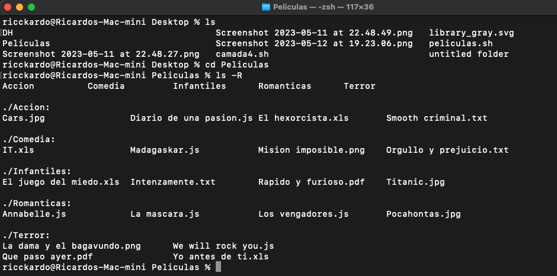

# Actividad Integradora Grupo 13

Utilización de comandos de la terminal de Git Bash

## Consigna


### 9.1 ¿Se pueden crear las carpetas del punto 2 en un solo comando? En caso que la respuesta sea positiva escribir el comando

```bash
  mkdir DH/Peliculas/Infantiles DH/Peliculas/Accion DH/Peliculas/Terror DH/Peliculas/Comedia DH/Peliculas/Romanticas
```
### 9.2 ¿Se pueden crear los archivos del punto 3 en un solo comando? En caso que la respuesta sea positiva escribir el comando
```bash
  touch DH/Peliculas/Infantiles/Intenzamente.txt DH/Peliculas/Infatiles/"El juego del miedo.xls" DH/Peliculas/Infantiles/"Rapido y furioso.pdf" DH/Peliculas/Infantiles/Titanic.jpg
```
### 9.3 Estando ubicados en la carpeta DH crear una carpeta llamada Prueba dentro de la carpeta Romanticas en un solo comando y escribirlo aquí.
```bash
  mkdir Peliculas/Romanticas/Prueba
```
### 9.4 Estando ubicados en la carpeta Romanticas crear una carpeta llamada Prueba2 dentro de la carpeta Accion
```bash
  mkdir DH/Peliculas/Accion/Prueba2
```
## Trabajando con VScode

### 3. Estando ubicados en la carpeta DH renombrar los archivos que están mal nombrados debido a faltas ortográficas.
```bash
  cd Peliculas/Infantiles && mv Intenzamente.txt Intensamente.txt && mv "La dama y el ba
gavundo.png" "La dama y el vagabundo.png" && mv Madagaskar.js Madgascar.js
cd ../../
cd Peliculas/Terror && mv "El hexorcista.xls" "El excorsista.xls"
```

### 4. Estando ubicados en la carpeta DH remover (eliminar) los archivos que no sean peliculas y corresponden a canciones en un solo comando c/u.
```bash
  rm Peliculas/Accion/"Smooth criminal.txt" && rm Peliculas/Comedia/"We will rock you.js"
```

### 5. Ubicados en la carpeta DH crear el archivo noBorrar.js en la carpeta prueba2. En un solo comando.
```bash
  touch Peliculas/Accion/prueba2/noBorrar.js
```

### 6. Ubicados en la carpeta peliculas mover el archivo noBorrar.js de la carpeta prueba2 a la carpeta prueba. En un solo comando.
```bash
  mv Accion/prueba2/noBorrar.js Romanticas/prueba/noBorrar.js
```

### 7. Ubicados en la carpeta DH crear un archivo llamado camadax.txt
```bash
  touch camadax.txt
```

### 8. Ubicados en la carpeta peliculas, mover el archivo IT a la carpeta infantiles. En un solo comando.
```bash
  cd Peliculas && mv Terror/IT.xls Infantiles/IT.xls
```

### 9. Ubicados en la carpeta peliculas eliminar el archivo camadax.txt
```bash
  rm ../camadax.txt
```

### 10. Ubicados en la carpeta peliculas eliminar la carpeta prueba. En un solo comando.
```bash
  rm -r Romanticas/prueba
```