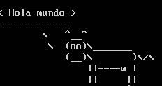
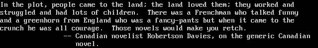
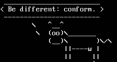

# Actividad en Clase 12 con Ubuntu

Crear un archivo en Google Documents o Word en la computadora, Investigar y contestar las siguientes preguntas. 

## ¿Qué es un usuario root en Linux? 
Root es la cuenta de superusuario en Unix y Linux. Es una cuenta de usuario con fines administrativos y, por lo general, tiene los derechos de acceso más altos en el sistema.

Por lo general, la cuenta de usuario root se llama root. Sin embargo, en Unix y Linux, cualquier cuenta con ID de usuario 0 es una cuenta raíz, independientemente del nombre. Es bastante común que ciertos administradores de sistemas tengan sus propias cuentas raíz en un sistema, con sus propias contraseñas.

## ¿Por qué ubuntu no me deja establecer la contraseña durante la instalación?
En las últimas versiones de Ubuntu, la distribución ha adoptado una política de seguridad llamada "sudo sin contraseña". Esto significa que durante la instalación, no se establece una contraseña para el usuario root, y en su lugar, se utiliza el comando "sudo" para realizar tareas administrativas.

Cuando se le pide una contraseña al instalar cosas, etc., es su propia contraseña la que debe usar. De esta manera, es posible permitir que otros realicen tareas administrativas sin tener que compartir contraseñas y claves. También se puede configurar para permitir que alguien ejecute un comando específico como root, pero no otros, pero normalmente no tocará eso.

## ¿Cuáles son los procesos típicos de Linux?¿Cómo identificarlos?
Linux tiene varios procesos típicos que se ejecutan en segundo plano para mantener el sistema en funcionamiento y realizar diversas tareas. Algunos de los procesos más comunes en Linux incluyen:
a) Init: Es el proceso principal que se inicia al arrancar el sistema y es responsable de iniciar y detener otros procesos y servicios.

b) Systemd: Es un sistema de inicialización utilizado en muchas distribuciones modernas de Linux. Gestiona los servicios del sistema y realiza el arranque paralelo de procesos.

c) Xorg: Es el servidor gráfico utilizado en la mayoría de las distribuciones de Linux. Es responsable de manejar la interfaz gráfica y proporcionar ventanas, escritorios y otras funciones relacionadas.

d) NetworkManager: Es un proceso encargado de la gestión de conexiones de red en el sistema, como WiFi y Ethernet.

e) SSHd: Es el demonio del protocolo SSH que permite conexiones seguras y remotas al sistema.

## Investigar y establecer una contraseña para el usuario root.
Para establecer una contraseña para el usuario root en Ubuntu, sigue estos pasos:

Abrir la terminal y escribir el siguiente comando
```bash
  sudo su
```
Se te pedirá que ingreses tu contraseña de usuario actual. Ingrésala y presiona Enter.

Ahora estás en una sesión como root. Para establecer una contraseña para el usuario root, ejecuta el siguiente comando:
```bash
  passwd
```
Se te pedirá que ingreses la nueva contraseña dos veces. Escribe la nueva contraseña y presiona Enter en cada ocasión. Asegúrate de elegir una contraseña segura y recordarla.

Una vez que hayas completado estos pasos, habrás establecido una nueva contraseña para el usuario root en Ubuntu. Es importante tener en cuenta que el uso del usuario root puede ser riesgoso, ya que otorga un control total sobre el sistema. Se recomienda utilizar privilegios de superusuario con precaución y solo cuando sea necesario.

## Opcional
- Escribir **en la terminal** el comando **apt install cowsay**.
- **Escribir en la terminal el comando cowsay “ Hola mundo “.**


- **Escribir en la terminal el comando sudo apt install fortune**
- **Escribir en la terminal  fortune.**


fortune | cowsay

